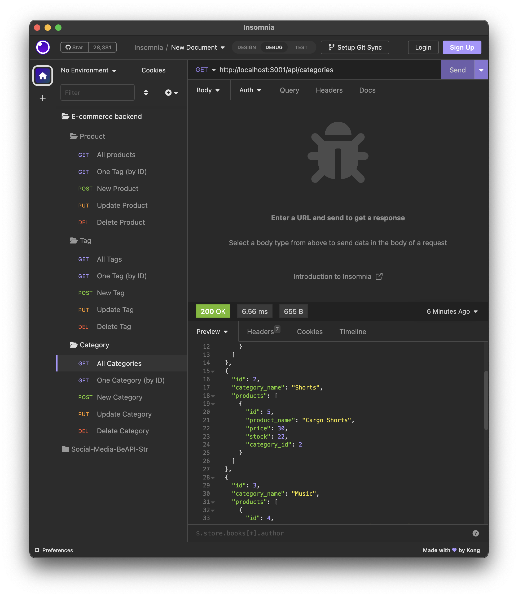

# vol_1_eCommBckEnd
Object-Relational Mapping (ORM): E-Commerce Back End

## Description
This is a MySQL database and application backend built for an e-commerce website. This application was built using MySQL2, Express, Sequelize, and dotenv.  

## Table of Contents
- [Installation](#installation)
- [Usage](#usage)
- [Link](#link)
- [Screenshots](#screenshots)
- [Technologies](#technologies)
- [License](#license)
- [Tests](#tests)
- [Credits](#credits)
- [Contact / Questions](#contact--questions)

## Installation
Clone the repo down onto your local machine.  
Run 'npm i' in the CLI to ensure you have all the necessary packages installed. 
You will also need to have MySQL already installed on your local machine.  
Log in to MySQL by using the command: 'mysql -u root -p'
When prompted, enter your password for MySQL. 
Create the database by using 'SOURCE db/schema.sql' in the MySQL shell.  
Finally, run 'npm run seed' to seed the database with default data.

## Usage (Instructions/How-To Use)
Run 'npm start' which will sync the database and start the server.

## Link
[Click Here](https://drive.google.com/file/d/13KadY20PfFWXU9hjYRmsd25BQ21Qvz5k/view) to go to the video link.

# Screenshots

## Technologies
JavaScript, Node.JS, Express.JS, MySQL, Sequelize, dotnev.  

## License
This project is licensed under the MIT license. For more information about this license and what it entails, visit the MIT website <a href="https://opensource.org/licenses/MIT">here</a>

## Tests
The following program is needed to run tests: Insomnia.  
Endpoints were tested with Insomnia. Please refer to the demo video to see the tests in action.  
If you should find any issues, submit a issue with a detailed explanation on how to recreate the bug.

## Credits
Christina Hall and Blair Millet. 

## Contact / Questions
  If you liked this project and want to see more, feel free to check out my other repos [here](https://github.com/tlequernaque).  
  For any questions or inquiries, you can reach me at t.lequernaque@yahoo.com for further information.